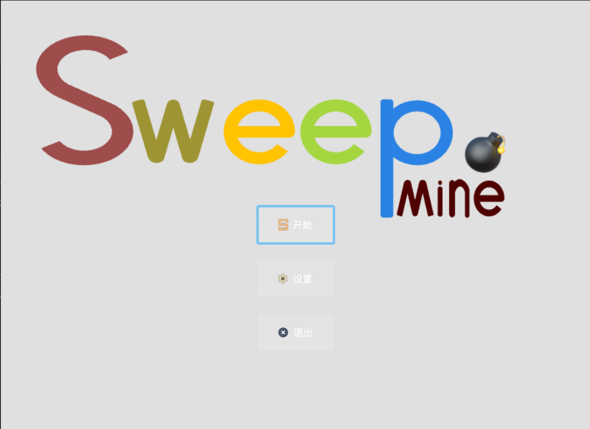

# Mines Cleaner
> 扫雷 （基于 C++/Qt）

### 闲言

建立初衷来自于刷视频时的灵感。
添加一些公式、题目，让大家在玩游戏的同时，不忘复习数学知识😊。


### 食用指北🧭

#### 下载🦐

克隆到本地或下载[release]()：

```bash
git clone https://github.com/Chenpeel/Mines_Cleaner.git
```

编译工具、库要求

- Qt5
- QtSql
- CMake

进入目录

```bash
cd Mines_Cleaner
```

创建build文件夹，进入build文件夹

```bash
mkdir build
cd build
```

使用cmake和make编译生成

```bash
cmake ..
make
```

运行（生成的可执行文件路径名可能不同，**仅以MacOS为例**）

```bash
./Mine_Sweeper.app/Contents/MacOS/Mine_Sweeper
```


<u>**注意**</u>⚠️

- cmake 和 make 工具需要提前下载
- [Cmake下载](https://cmake.org/download/)，[Make下载](https://www.gnu.org/software/make/)、[在windows上安装make](https://zhuanlan.zhihu.com/p/630244738)


### 简单展示

1. 进入游戏 
   

2. 选择难度

3. 点击探索
4. 锚定数目
5. 扫除所有
6. 扫除失败


### ToDo 

- [x] 本地基础题(10 ~ 20)
- [ ] 可自行导入题目库
  - [ ] 自定 Latex / Markdown 公式导入器，渲染，存储到题目库
  - [ ] 云端题库


